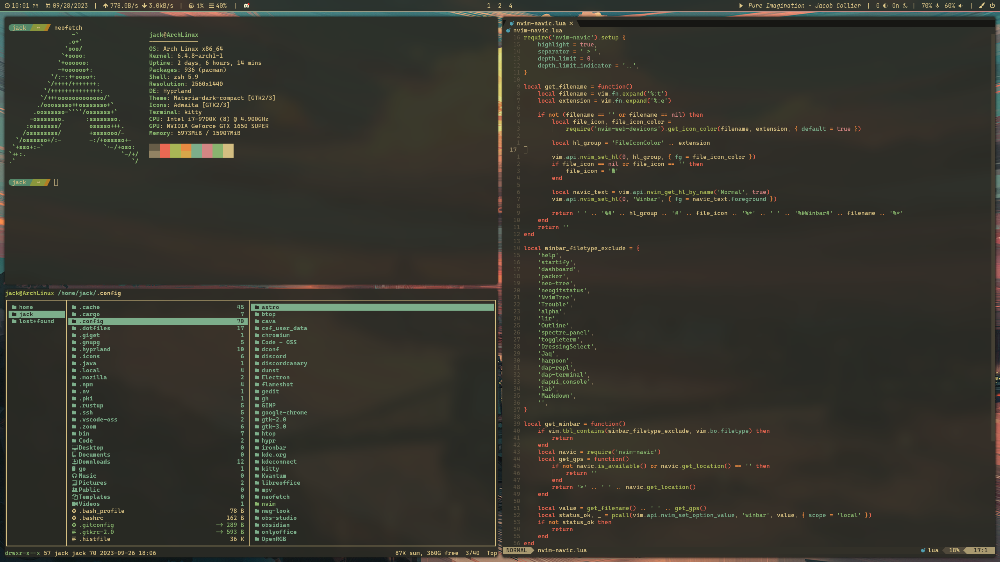

# .dotfiles
My dotfiles for Arch Linux :P

https://github.com/BvngeeCord/.dotfiles/assets/69218859/af01ba37-2d2e-459f-bea6-7171a7a72a64

This is the cultivation of at least 6 months (as of the time of writing) of effort. It includes countless custom shell scripts, program configuration, custom styling and theming, and more. Most notably, `bin`, `rofi`, and `waybar`, and `hyprland`. 
Scroll through it yourself if you're really curious :P

NOTE: This does not include my current Neovim configuration nor my ZSH config, as I plan to redo both from scratch later on. Slightly out of date versions of both can be found in my .dotfiles-wsl2 github repo.

Managed with GNU Stow. No install script will be provided, nor do I recommend using much of this. They're here so I don't lose them, and to show people who ask. I don't recommend copying!
